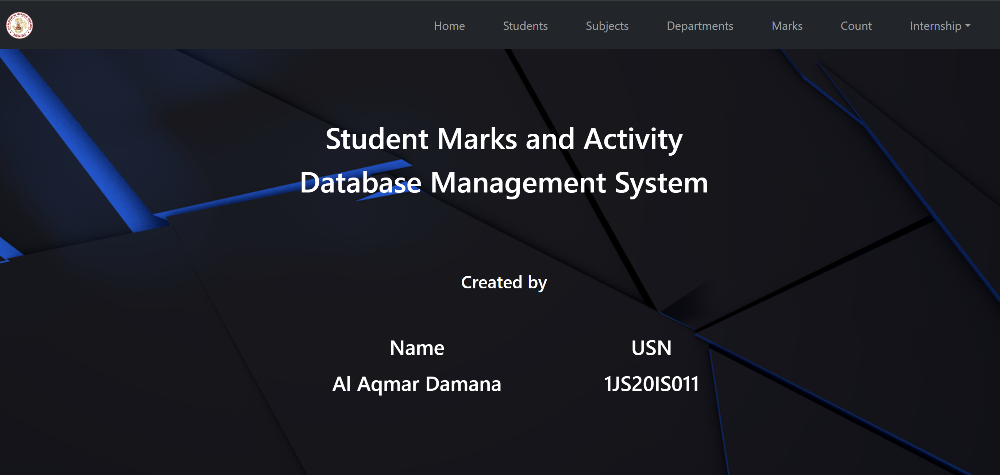
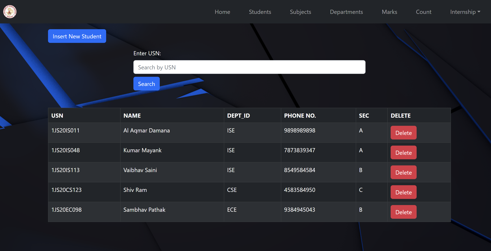
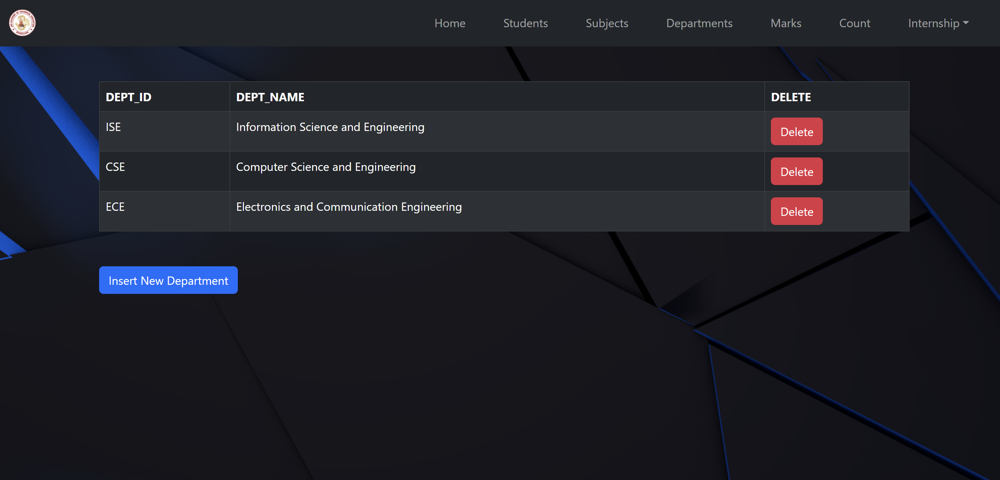
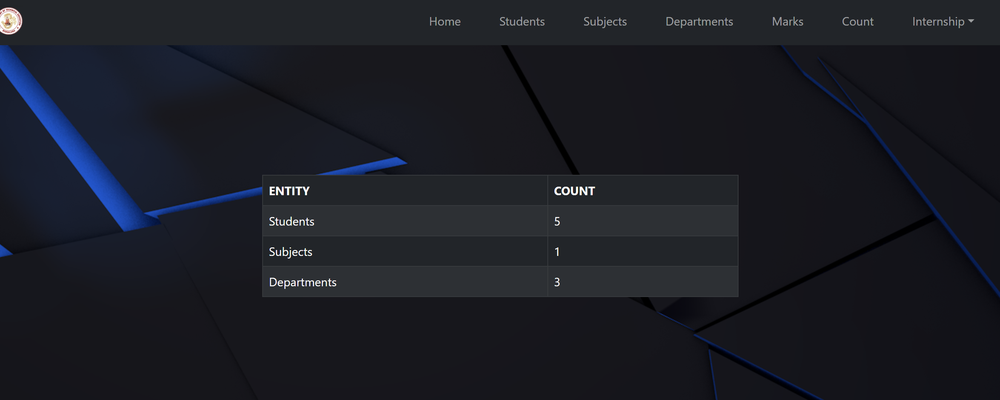
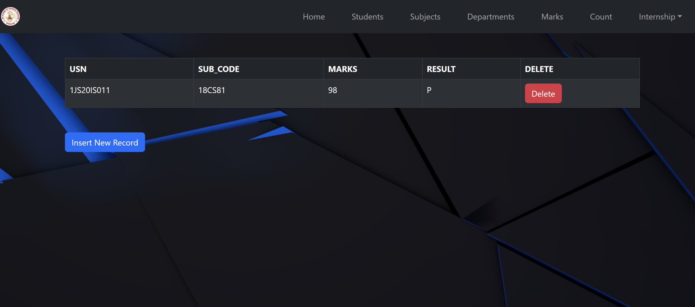

# Student Management System

The Student Management System built with Flask and SQL offers a comprehensive platform for departmental record-keeping. Users can seamlessly add and manage departments, students, subjects, marks, internship activities, and participation records. Additionally, the system facilitates efficient searching and deletion of student records. This project streamlines administrative tasks for teachers and departments, ensuring accurate and accessible student data management.

The above images just show a few examples records and the UI.

A detailed report on the project can be found along with the project.
